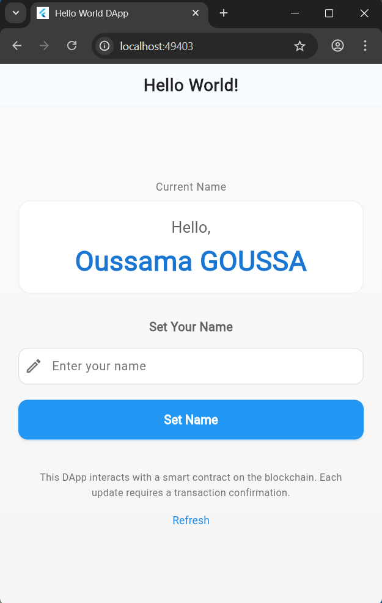

# Ethereum Smart Contract Flutter DApp

A clean and professional Flutter application demonstrating Ethereum blockchain integration with smart contracts.



## ✨ Features

- **Blockchain Connection**: Connect to local Ethereum blockchain (Ganache)
- **Smart Contract Interaction**: Read and write operations to deployed contracts
- **Real-time Updates**: Live transaction status monitoring
- **Professional UI**: Modern Flutter interface with smooth animations
- **Error Handling**: Comprehensive error states and user feedback

## 🚀 Quick Start

### Prerequisites
- Flutter SDK (>=3.0.0)
- Ganache (local Ethereum blockchain)
- Node.js & npm (for Truffle if needed)

### Installation

```bash
# Clone the repository
git clone https://github.com/oussama-goussa/ethereum-smart-contract-flutter.git

# Navigate to project
cd ethereum-smart-contract-flutter

# Install dependencies
flutter pub get
```

### Running the App

```bash
# Run on Chrome
flutter run -d chrome

# Or run on your preferred device
flutter run
```

## 🏗️ Project Structure

```
lib/
├── main.dart              # App entry & theme configuration
├── helloUI.dart          # Main user interface
└── contract_linking.dart # Blockchain interaction logic

src/artifacts/            # Smart contract ABI files
screenshots/              # Application screenshots
```

## 🔧 Configuration

1. Start Ganache on `http://127.0.0.1:7545`
2. Deploy your HelloWorld.sol contract
3. Update contract address in `contract_linking.dart` if needed
4. Ensure private key matches your Ganache account

## 📖 How It Works

1. **Connection**: App connects to Ganache via web3dart
2. **Reading**: Fetches current name from smart contract
3. **Writing**: Updates name via blockchain transaction
4. **Confirmation**: Waits for transaction mining and updates UI

## 🛠️ Tech Stack

- **Flutter** - UI framework
- **web3dart** - Ethereum blockchain interaction
- **Provider** - State management
- **Ganache** - Local Ethereum testnet

## 📚 What You'll Learn

- Connecting Flutter apps to Ethereum
- Interacting with smart contracts
- Handling blockchain transactions
- Managing async states in Flutter
- Building professional DApp interfaces

## 🤝 Contributing

Feel free to fork this project and submit pull requests with improvements.

<div align="center">
Built with ❤️ by Oussama GOUSSA
⭐ Star this repo if you find it useful!

https://img.shields.io/github/stars/oussama-goussa/ethereum-smart-contract-flutter?style=for-the-badge
https://img.shields.io/github/forks/oussama-goussa/ethereum-smart-contract-flutter?style=for-the-badge
https://img.shields.io/github/issues/oussama-goussa/ethereum-smart-contract-flutter?style=for-the-badge

</div>


